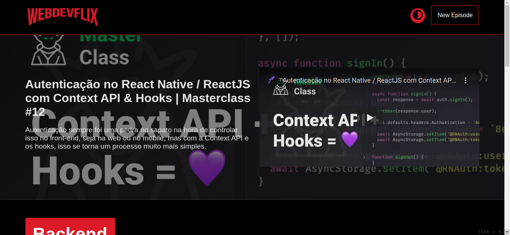
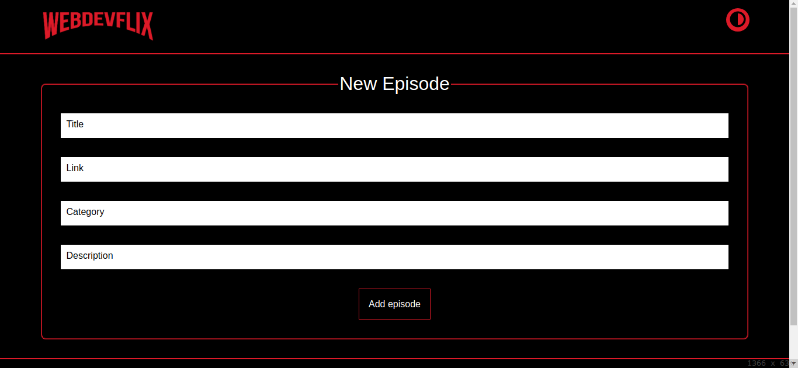

<p align="center"> 
  
</p> 

<h1 align="center"> WebdevFlix </h1>

<p align="center">
  <a href="https://github.com/ErickLuizA/WebdevFlix/graphs/commit-activity" alt="Maintenance">
    
  </a>

  <a href="https://WebdevFlix.netlify.app/" alt="WebdevFlix website">
    
  </a>

  <a href="./LICENSE" alt="License: MIT">
    
  </a>

<br/>


<a href="https://github.com/ErickLuizA/WebdevFlix/stargazers">
  
</a>


<p align="center">
  <a href="#clipboard-description">Description</a>&nbsp;&nbsp;&nbsp;|&nbsp;&nbsp;&nbsp;
  <a href="#building_construction-technologies">Technologies</a>&nbsp;&nbsp;&nbsp;|&nbsp;&nbsp;&nbsp;
  <a href="#rocket-getting-started">Getting Started</a>&nbsp;&nbsp;&nbsp;|&nbsp;&nbsp;&nbsp;
  <a href="#memo-license">License</a>&nbsp;&nbsp;&nbsp;|&nbsp;&nbsp;&nbsp;
  <a href="#framed_picture-screenshots">Screenshots</a>
</p>


## :clipboard: Description
WebdevFlix is a netflix based app for web dev related videos


## :building_construction: Technologies
- [ReactJS](https://www.reactjs.org)
  - [React-router-dom](https://reactrouter.com/web/guides/quick-start)

## :rocket: Getting Started

## 1. Download the repository

```shell
 $ git clone https://github.com/ErickLuizA/WebdevFlix.git
```

## 2. Installation

``` shell
# Go into the repository

$ cd WebdevFlix
```

``` shell
# Install dependencies

$ yarn install
```

## 3. Execution

```shell
$ yarn start
```

## :framed_picture: Screenshots

<div>
  
  
</div>

> [Live Demo](https://webdevflix.netlify.app/)


## :memo: License

This project is under the MIT license. See the file [LICENSE](LICENSE) for more details.

---

Build with 💙 By [Erick](https://www.linkedin.com/in/erick-luiz-47151a1a4/)
